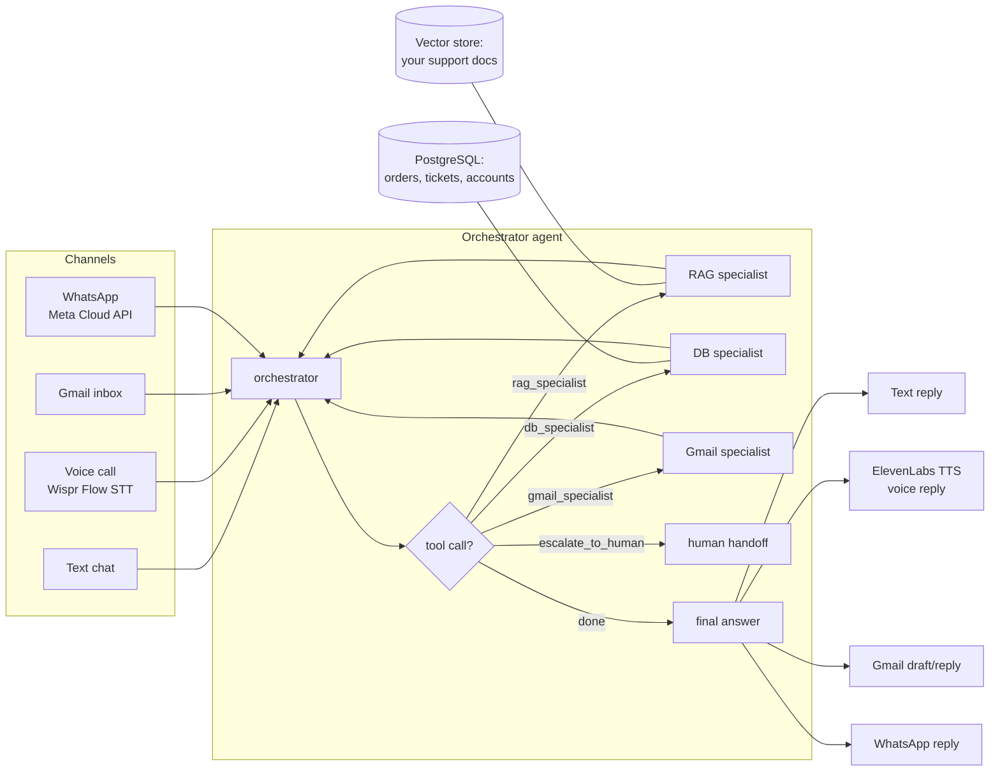

# Building a Customer Support Assistant: Multi-Agent LangGraph + RAG + Voice + Email + WhatsApp

A learning-oriented architecture guide for a multi-channel (text, voice, email, WhatsApp) customer support agent, aimed at production-grade quality. You write the code; use this as the reference to check your work against.

## 1. The core idea

An **orchestrator agent** that decides what needs to happen, backed by **specialist agents** it can call as tools — a RAG specialist (grounds answers in your docs), a DB specialist (looks up live data, can create pending actions like refunds), and a Gmail specialist (reads/drafts support emails). Multiple *channels* feed into the same orchestrator: text chat, voice (Wispr Flow in / ElevenLabs out), email (Gmail), and WhatsApp (Meta Cloud API).



Why this shape instead of a fixed pipeline (classify → retrieve → generate): real support requests are often compound — "I want a refund for order #123" needs an order lookup *and* a policy lookup, and the second one might depend on the first. A fixed linear pipeline can't express "call X, then based on the result, maybe call Y" without hand-coding a new branch for every combination. A single orchestrator that can call any specialist, in any order, and chain results, handles this naturally — the same mechanism you'd use for a single tool call scales to a compound request without new graph edges.

The channel/reasoning separation from before still holds: each channel is a thin adapter converting its input into a message and the orchestrator's output back into text, audio, or a draft — you build the reasoning once.

## 2. LangGraph: orchestrator + specialists

Each **specialist is its own small agent** — a tiny `StateGraph` with an LLM bound to a narrow set of tools, wrapped in a `@tool` function so the orchestrator can call the whole specialist the same way it'd call any single tool. The **orchestrator** is built exactly the same way, just one level up: an LLM bound to the specialists (as tools), looping until it has enough to answer.

Core building blocks (same primitives as always, applied twice):

- **State**: the orchestrator's state holds the conversation (`messages`) and channel info. Specialists can use a minimal state (just `messages`) since they're invoked fresh per call — see the note below on memory.
- **Nodes**: an `agent` node (the LLM deciding what to do) and a `tools` node (`ToolNode`) for both the orchestrator and each specialist.
- **`tools_condition`**: LangGraph's prebuilt conditional edge — routes to the tools node if the model requested a tool call, otherwise ends. Same building block reused at every level.
- **Checkpointer**: attached to the **orchestrator's** compiled graph only. Specialists are invoked with `.invoke({"messages": [...]})` fresh each time — they don't carry conversation memory of their own; the orchestrator's checkpointed history is the single source of truth for "what has this customer said so far."

Skeleton:

```python
from typing import Annotated, List
from operator import add
from typing_extensions import TypedDict
from langgraph.graph import StateGraph, START, END, MessagesState
from langgraph.prebuilt import ToolNode, tools_condition
from langgraph.checkpoint.memory import MemorySaver
from langchain_core.tools import tool
from langchain_core.messages import HumanMessage

class SupportState(TypedDict):
    messages: Annotated[List, add]
    channel: str

# --- RAG specialist: its own tiny agent, one tool ---
rag_llm = llm.bind_tools([search_knowledge_base])  # search_knowledge_base defined in §3

def rag_agent_node(state: MessagesState):
    return {"messages": [rag_llm.invoke(state["messages"])]}

rag_graph = StateGraph(MessagesState)
rag_graph.add_node("agent", rag_agent_node)
rag_graph.add_node("tools", ToolNode([search_knowledge_base]))
rag_graph.add_edge(START, "agent")
rag_graph.add_conditional_edges("agent", tools_condition, {"tools": "tools", END: END})
rag_graph.add_edge("tools", "agent")
rag_agent = rag_graph.compile()

@tool
def rag_specialist(question: str) -> str:
    """Ask the knowledge-base specialist about policies, FAQs, or troubleshooting
    steps. Always use this for anything involving a policy, price, timeline, or
    procedure — never answer those from memory."""
    result = rag_agent.invoke({"messages": [HumanMessage(question)]})
    return result["messages"][-1].content

# db_specialist and gmail_specialist follow the identical shape (§6, §7)

# --- Orchestrator: same pattern, one level up ---
specialists = [rag_specialist, db_specialist, gmail_specialist, escalate_to_human]  # §8
orchestrator_llm = llm.bind_tools(specialists)

def orchestrator_node(state: SupportState):
    return {"messages": [orchestrator_llm.invoke(state["messages"])]}

graph = StateGraph(SupportState)
graph.add_node("orchestrator", orchestrator_node)
graph.add_node("specialists", ToolNode(specialists))
graph.add_edge(START, "orchestrator")
graph.add_conditional_edges("orchestrator", tools_condition, {"tools": "specialists", END: END})
graph.add_edge("specialists", "orchestrator")

app = graph.compile(checkpointer=MemorySaver())
```

Each channel calls `app.invoke(...)` (or `.stream(...)`) with a `thread_id` per conversation, same as before — this part of the design doesn't change regardless of what's happening inside the orchestrator.

**Why specialists as wrapped agents, not flat tools:** this is what makes the reflection pattern (§9) and per-domain customization possible without touching the orchestrator. The RAG specialist's internal subgraph can grow a self-critique step, use a different model, or add a second tool — none of that changes its `@tool` signature from the orchestrator's point of view. That isolation is the entire point of splitting into specialists instead of putting every tool flat on one agent.

**Trade-off worth knowing:** more LLM calls per turn than a flat single-agent design (orchestrator decides → specialist decides → specialist's tool executes → specialist composes → orchestrator composes), so latency and cost go up, especially noticeable on the voice channel. Worth it once you have several heterogeneous domains and want to evolve them independently; overkill if you only ever have one or two tools total.

## 3. RAG: grounding answers, as a specialist

Right now your project folder has no real documents yet — the first real step is dropping your support material in (FAQs, policy docs, product manuals, past resolved tickets) so the agent has something to ground answers in instead of hallucinating.

Ingestion pipeline (unchanged regardless of architecture):

1. **Ingest**: load files (PDF, markdown, HTML export from a help center, etc.).
2. **Chunk**: split into ~300–800 token pieces with some overlap. Chunk by semantic unit (a whole FAQ entry, a whole policy paragraph) where possible rather than a fixed character count.
3. **Embed**: turn each chunk into a vector (a local model via `sentence-transformers`/`langchain-huggingface` avoids per-call API cost; OpenAI/other embedding APIs are the alternative).
4. **Store**: a vector database — `Chroma` (local, zero setup) is enough for a learning project; move to Pinecone/Weaviate/pgvector only once you need scale or multi-tenant filtering.

**Retrieval and grounding now live inside the RAG specialist**, not a fixed `retrieve_context` node:

```python
from langchain_core.tools import tool

@tool
def search_knowledge_base(query: str) -> str:
    """Search Lumen Home's policy/FAQ/troubleshooting docs for information
    relevant to the query. Returns the most relevant passages found."""
    results = vectorstore.similarity_search_with_score(query=query, k=4)
    return "\n\n".join(doc.page_content for doc, _ in results)
```

The RAG specialist's own system prompt (in `rag_agent_node`'s bound LLM) carries the grounding instruction that used to live in `generate_response`: answer only from what `search_knowledge_base` returns, say when the docs don't cover something, don't invent policy details.

One thing this architecture fixes on its own: earlier drafts of this project hard-filtered retrieval by a separately classified intent category (billing/technical/account/other), which risked missing chunks from mixed-topic docs like a general FAQ if the classifier's guess didn't match how a chunk got tagged at ingest time. Since the RAG specialist just searches directly with no hard category gate, that failure mode goes away — category metadata is still worth keeping on your chunks (useful for logging, or later as a soft boost rather than a hard filter), just not as something that can silently exclude the right answer.

Two practical tips worth keeping from before: keep a separate vector store per data-sensitivity tier if you ever mix public docs with internal/customer-specific data, and re-run ingestion whenever the source docs change.

## 4. Voice in: Wispr Flow (speech-to-text)

Wispr Flow exposes a developer API for turning audio into clean text. It's a channel adapter — it doesn't change based on what's inside the orchestrator, it just turns speech into the same `messages` format every channel uses:

```python
# Pseudocode — check api-docs.wisprflow.ai for current auth/endpoint details.
transcript = wispr_flow_client.transcribe(audio_bytes)
state["messages"].append({"role": "user", "content": transcript})
result = app.invoke(state, config={"configurable": {"thread_id": call_id}})
```

## 5. Voice out: ElevenLabs (text-to-speech / conversational agent)

Two integration options, same as before:

- **TTS-only** (recommended to start): the orchestrator produces text as usual, and you call ElevenLabs' `text_to_speech.convert` to synthesize the reply.
- **ElevenLabs Conversational AI ("ElevenAgents")**: a hosted platform where ElevenLabs handles voice turn-taking and can call tools/webhooks mid-conversation. More turnkey, but shifts orchestration out of LangGraph — explore later, not first.

```python
from elevenlabs.client import ElevenLabs

client = ElevenLabs(api_key=ELEVENLABS_API_KEY)
audio = client.text_to_speech.convert(
    voice_id="<your chosen voice id>",
    text=reply_text,
    model_id="eleven_turbo_v2_5",  # check current model names in ElevenLabs docs
)
```

## 6. Email channel: the Gmail specialist

Gmail becomes a specialist agent, same shape as the RAG specialist, bound to the Gmail MCP tools (`search_threads`, `get_thread`, `create_draft`, ...) instead of `search_knowledge_base`:

```python
gmail_llm = llm.bind_tools([search_threads, get_thread, create_draft])
# ... identical StateGraph shape as rag_agent ...
gmail_agent = gmail_graph.compile()

@tool
def gmail_specialist(request: str) -> str:
    """Ask the email specialist to search, read, or draft a reply to a support
    email. Only ever creates drafts for human review — never sends automatically."""
    result = gmail_agent.invoke({"messages": [HumanMessage(request)]})
    return result["messages"][-1].content
```

The safety rule from before still applies, just enforced at the specialist's tool selection instead of a `format_for_channel_email` node: **the Gmail specialist's tool list only ever includes `create_draft`, never a send tool.** Email is asynchronous and mistakes are costly, so a human reviews and hits send. Once you trust the agent's accuracy on a narrow set of intents, you can selectively auto-send only for those — but that's a deliberate, later decision, not the default.

## 7. The DB specialist: live data lookups and pending actions

The DB specialist handles two different kinds of database work, and they need different levels of caution:

**Reads** (order status, account plan) — same rules as before:

```python
from langchain_core.tools import tool
import psycopg

@tool
def get_order_status(order_id: str, customer_email: str) -> str:
    """Look up the status of a customer's order. Requires both the order id
    and the email on the account, so the tool itself enforces you can't fetch
    someone else's order by guessing an id."""
    with psycopg.connect(READ_ONLY_DB_DSN) as conn:
        row = conn.execute(
            "SELECT status, eta FROM orders WHERE order_id = %s AND customer_email = %s",
            (order_id, customer_email),
        ).fetchone()
    return f"status={row[0]}, eta={row[1]}" if row else "no matching order found"
```

**Writes with real-world consequences** (refunds, cancellations) — never let the orchestrator or the DB specialist execute these directly. The tool creates a *pending* record; a human approves it separately:

```python
@tool
def create_refund_request(order_id: str, customer_email: str, reason: str) -> str:
    """Create a pending refund request for human review. Does NOT issue a
    refund — a human must approve it before any money moves."""
    with psycopg.connect(WRITE_LIMITED_DB_DSN) as conn:
        conn.execute(
            "INSERT INTO pending_refunds (order_id, customer_email, reason, status) "
            "VALUES (%s, %s, %s, 'pending_review')",
            (order_id, customer_email, reason),
        )
    return "Refund request created and is pending human approval."
```

Non-negotiable rules, unchanged from before and just as true inside a specialist as they were in a flat tool list:

- **Never let the LLM write raw SQL against a writable connection.** Small, specific, parameterized functions only.
- **Use a read-only DB role** for `get_order_status` and similar lookups (`GRANT SELECT` only).
- **Use a separately, narrowly scoped role** for `create_refund_request` — it can insert into `pending_refunds`, nothing else; it has no ability to touch the `orders` or `payments` tables directly, and no tool in this codebase should ever be able to actually move money autonomously.
- **Scope every query to the authenticated customer** (require their own email/account id as a parameter).
- **Pool connections** rather than opening a new one per call.

Wrap both tools in the `db_specialist` agent the same way as the RAG specialist:

```python
db_llm = llm.bind_tools([get_order_status, create_refund_request])
# ... identical StateGraph shape ...
db_agent = db_graph.compile()

@tool
def db_specialist(request: str) -> str:
    """Ask the database specialist to look up an order/account, or to create
    a pending refund request. Requires the customer's order id and email."""
    result = db_agent.invoke({"messages": [HumanMessage(request)]})
    return result["messages"][-1].content
```

This is exactly the mechanism that makes the refund scenario from earlier work: a customer asking for a refund needs the orchestrator to call `db_specialist` (check the order) *and* `rag_specialist` (check the refund policy) before it has enough information to decide whether to call `create_refund_request` or `escalate_to_human` — and it can do that because both are just tools it's free to call in whatever order the situation calls for.

## 8. Escalation as a tool

Instead of a fixed `route_after_generate` conditional edge checking a `confidence` field in shared state, escalation is now something the orchestrator decides to do, the same way it decides to call any specialist:

```python
@tool
def escalate_to_human(summary: str, reason: str) -> str:
    """Hand this conversation off to a human agent. Use this when: a specialist
    reports it doesn't have enough information to answer confidently, the
    customer explicitly asks for a person, or the request involves something
    sensitive (security concerns, safety issues, anything the specialists'
    tools can't resolve)."""
    create_ticket(summary=summary, reason=reason)  # your ticketing/notification logic
    return "This has been escalated to a human agent who will follow up."
```

The orchestrator's system prompt is where this actually gets enforced — spell out the triggers explicitly ("if `rag_specialist` indicates the knowledge base doesn't cover something, call `escalate_to_human` rather than answering from your own knowledge"; "if the customer asks for a human, don't argue, escalate"). This is enforcement-by-instruction rather than enforcement-by-graph-structure, which is inherently a bit weaker than the old fixed-edge approach — worth specifically testing for in your eval set: does the orchestrator actually escalate on your out-of-scope test questions, or does it sometimes try to answer anyway.

The RAG specialist's confidence signal (retrieval distance from `similarity_search_with_score` — see the earlier discussion on why lower distance means a better match) is still useful here: build it into `search_knowledge_base`'s return value (e.g., note explicitly in the returned text if the best match was a poor one) so the RAG specialist's own response can honestly say "I don't have good information on this" back to the orchestrator, which is what should trigger the escalation instruction above.

## 9. Reflection pattern: making a specialist self-check

Because each specialist is its own subgraph, you can add a critique/revise loop to just one of them without touching the orchestrator or the others. The RAG specialist is the best candidate — it's where hallucination risk is highest, since it's the one specialist explicitly meant to only say things that are actually in your docs.

Shape: after the RAG specialist's agent node produces a draft answer, add a `critique` node that checks the draft against what `search_knowledge_base` actually returned, and either accepts it or asks for a revision:

```python
class RagState(MessagesState):
    context: str
    draft: str
    revision_count: int

def critique_node(state: RagState):
    check = critique_llm.invoke([
        ("system", "Does this draft answer ONLY use information present in the "
                    "context below? Reply APPROVED, or explain what's unsupported.\n\n"
                    f"Context:\n{state['context']}"),
        ("human", state["draft"]),
    ])
    if "APPROVED" in check.content or state["revision_count"] >= 2:  # cap retries
        return {"messages": [AIMessage(state["draft"])]}
    return {"messages": [HumanMessage(f"Revise — {check.content}")], "revision_count": state["revision_count"] + 1}
```

Wire it in after the RAG specialist's agent node, looping back to `agent` if a revision is requested, ending once approved. This is a direct, more capable version of the "groundedness check" confidence signal discussed earlier — instead of just flagging low confidence, it gives the specialist a chance to fix the problem before ever returning to the orchestrator. Cap the retry count (as above) so a stubborn draft can't loop forever — fall through to returning the draft as-is (or triggering escalation) after a couple of attempts.

Don't build this before the plain orchestrator + specialists skeleton is working end to end — it's an enhancement to one specialist's internals, and it's much easier to tell whether it's helping once you already trust the rest of the pipeline.

## 10. WhatsApp channel (Meta Cloud API)

Meta's WhatsApp Cloud API is the official, directly-from-Meta option (no Twilio markup), with a free tier for a monthly volume of conversations. Two moving parts:

- **Receiving**: Meta calls a webhook URL you host whenever a customer messages your business number. You verify the webhook once (a `GET` with a challenge token you echo back), then handle incoming `POST` requests.
- **Sending**: a plain HTTP POST to the Graph API.

```python
# Receiving (FastAPI example)
from fastapi import FastAPI, Request

app_api = FastAPI()

@app_api.get("/webhook")
def verify(hub_mode: str = None, hub_challenge: str = None, hub_verify_token: str = None):
    if hub_verify_token == WHATSAPP_VERIFY_TOKEN:
        return int(hub_challenge)
    return {"error": "invalid verify token"}, 403

@app_api.post("/webhook")
async def incoming(request: Request):
    payload = await request.json()
    msg = payload["entry"][0]["changes"][0]["value"]["messages"][0]
    from_number = msg["from"]
    text = msg["text"]["body"]

    result = app.invoke({"messages": [HumanMessage(text)]}, config={"configurable": {"thread_id": from_number}})
    send_whatsapp_message(from_number, result["messages"][-1].content)
    return {"status": "ok"}

# Sending
import httpx

def send_whatsapp_message(to: str, body: str):
    httpx.post(
        f"https://graph.facebook.com/v22.0/{PHONE_NUMBER_ID}/messages",
        headers={"Authorization": f"Bearer {WHATSAPP_ACCESS_TOKEN}"},
        json={"messaging_product": "whatsapp", "to": to, "text": {"body": body}},
    )
```

Notes specific to this channel: use the customer's phone number as the LangGraph `thread_id` (same pattern as the email thread id / voice call id), verify the `X-Hub-Signature-256` header on incoming webhooks, and remember Meta requires pre-approved message *templates* if you want to message a customer first (outside a 24-hour window since their last message) — free-form replies are fine within that window.

## 11. Suggested build order

Building all of this at once makes debugging hard, since you can't tell if a bad answer is a specialist problem, an orchestrator routing problem, or a channel-adapter problem. A more learnable order:

1. **RAG specialist alone.** Get `search_knowledge_base` and the RAG specialist's own agent loop working against your test docs, tested by invoking `rag_agent` directly — no orchestrator yet. This is where most of the core "agent building" learning happens.
2. **Orchestrator + RAG specialist only.** Wrap the RAG specialist as a tool, build the orchestrator loop around it, and confirm routing works for simple single-domain questions plus a checkpointer for multi-turn memory.
3. **Add the DB specialist** (`get_order_status`, `create_refund_request`) and test the compound case explicitly: a refund request that needs both `db_specialist` and `rag_specialist` called in the right order.
4. **Add `escalate_to_human`** and test it fires correctly: out-of-scope questions, explicit "let me talk to a person" requests, and low-confidence RAG results.
5. **Add the Gmail specialist** (draft-only) — reuses the same orchestrator, just a new specialist and a new channel adapter.
6. **Add WhatsApp**, same idea — a webhook adapter in front of the same orchestrator.
7. **Add voice** (Wispr Flow in, ElevenLabs out) — the most "plumbing," least "agent logic," so save it for once the reasoning core is solid.
8. **Add the reflection loop to the RAG specialist** (§9) — an enhancement to one already-working piece, not a prerequisite for anything else.
9. **Evaluate continuously**: test questions with known-good answers, run through both the RAG specialist alone and the full orchestrator, checking not just final answers but *which specialists got called* — this is what separates a demo from something you'd trust with real customers.

## 12. Making this production-grade

Things a demo skips that a system handling real customers can't:

- **Persistent checkpointer on the orchestrator.** `MemorySaver` lives in process memory and is gone on restart. Swap in `PostgresSaver` so conversations survive deploys and you can run more than one server process. Specialists don't need their own checkpointer — they're invoked fresh per call.
- **Structured logging + tracing**, now across two levels: which specialists the orchestrator called and in what order, plus each specialist's own internal tool calls (RAG's retrieved chunks/distances, DB's queries). Tag every log line with `thread_id`. LangSmith gives you this with minimal setup; a structured JSON logger works too.
- **Timeouts and retries** on every external call (LLM, embeddings, DB, ElevenLabs, WhatsApp/Gmail APIs) — remember a single orchestrator turn may now involve several chained LLM calls across specialists, so a slow/failing call anywhere in that chain needs to fail gracefully, not hang the whole conversation.
- **Rate limiting per customer/thread.**
- **Secrets management** — API keys and DB credentials in environment variables or a secrets manager, never committed.
- **Webhook signature verification** for Gmail push notifications and WhatsApp (`X-Hub-Signature-256`).
- **PII handling** — know what's flowing through logs and to third-party APIs (OpenAI/Anthropic, ElevenLabs) and redact what you don't need to send.
- **Deployment shape**: a small FastAPI app exposing the WhatsApp and Gmail webhook endpoints (and a chat endpoint), running the compiled orchestrator `app` per request, containerized (Docker), behind HTTPS. Outbound sends are good candidates for a background task queue. See §13 for the full CI/CD → Docker → Kubernetes → ArgoCD path.
- **Idempotency** — dedupe on the provider's message id so retried webhooks don't double-process.

## 13. Deployment infrastructure: Docker, CI/CD, Kubernetes, ArgoCD

This is the path from "runs on my laptop" to "runs in production, deploys safely, and rolls back if something breaks." Layers, in order:

**Docker** — package the app so it runs the same everywhere. Multi-stage build keeps the final image small (build deps don't ship):

```dockerfile
# Dockerfile
FROM python:3.12-slim AS builder
WORKDIR /app
COPY requirements.txt .
RUN pip install --no-cache-dir --user -r requirements.txt

FROM python:3.12-slim
WORKDIR /app
COPY --from=builder /root/.local /root/.local
COPY . .
ENV PATH=/root/.local/bin:$PATH
ENV PYTHONUNBUFFERED=1
EXPOSE 8000
HEALTHCHECK --interval=30s --timeout=3s CMD curl -f http://localhost:8000/health || exit 1
CMD ["uvicorn", "src.main:app_api", "--host", "0.0.0.0", "--port", "8000"]
```

**CI (GitHub Actions)** — on every push: lint, run tests (including the eval set from §11), build the image, push to a registry. CI should **not** deploy directly — that's ArgoCD's job, triggered by CI updating a manifest, not by CI calling `kubectl`.

```yaml
# .github/workflows/ci.yml
name: CI
on:
  push:
    branches: [main]
  pull_request:

jobs:
  test:
    runs-on: ubuntu-latest
    steps:
      - uses: actions/checkout@v4
      - uses: actions/setup-python@v5
        with: { python-version: "3.12" }
      - run: pip install -r requirements.txt
      - run: pytest tests/
      - run: python scripts/run_eval.py

  build-and-push:
    needs: test
    if: github.ref == 'refs/heads/main'
    runs-on: ubuntu-latest
    steps:
      - uses: actions/checkout@v4
      - uses: docker/build-push-action@v6
        with:
          push: true
          tags: ghcr.io/<you>/support-agent:${{ github.sha }}

  bump-manifest:
    needs: build-and-push
    runs-on: ubuntu-latest
    steps:
      - uses: actions/checkout@v4
        with:
          repository: <you>/support-agent-config
          token: ${{ secrets.GITOPS_REPO_TOKEN }}
      - run: |
          sed -i "s|image: ghcr.io/<you>/support-agent:.*|image: ghcr.io/<you>/support-agent:${{ github.sha }}|" k8s/deployment.yaml
          git commit -am "bump image to ${{ github.sha }}" && git push
```

**Kubernetes** — the runtime. Minimum viable set of manifests:

```yaml
# k8s/deployment.yaml
apiVersion: apps/v1
kind: Deployment
metadata:
  name: support-agent
spec:
  replicas: 2
  selector: { matchLabels: { app: support-agent } }
  template:
    metadata: { labels: { app: support-agent } }
    spec:
      containers:
        - name: support-agent
          image: ghcr.io/<you>/support-agent:latest
          ports: [{ containerPort: 8000 }]
          envFrom:
            - secretRef: { name: support-agent-secrets }
          readinessProbe:
            httpGet: { path: /health, port: 8000 }
            initialDelaySeconds: 5
          livenessProbe:
            httpGet: { path: /health, port: 8000 }
            initialDelaySeconds: 15
          resources:
            requests: { cpu: "250m", memory: "256Mi" }
            limits: { cpu: "1", memory: "512Mi" }
---
apiVersion: v1
kind: Service
metadata: { name: support-agent }
spec:
  selector: { app: support-agent }
  ports: [{ port: 80, targetPort: 8000 }]
---
apiVersion: autoscaling/v2
kind: HorizontalPodAutoscaler
metadata: { name: support-agent }
spec:
  scaleTargetRef: { apiVersion: apps/v1, kind: Deployment, name: support-agent }
  minReplicas: 2
  maxReplicas: 8
  metrics:
    - type: Resource
      resource: { name: cpu, target: { type: Utilization, averageUtilization: 70 } }
```

`readinessProbe` controls whether a pod receives traffic (fails during startup); `livenessProbe` controls whether Kubernetes restarts the pod (fails only if the process is truly stuck) — conflating the two causes slow rollouts or unnecessary restarts. Secrets (`support-agent-secrets`) hold your LLM/ElevenLabs/Wispr Flow/WhatsApp/DB credentials as a Kubernetes `Secret` — never baked into the image or the plain manifest.

**ArgoCD (GitOps)** — instead of CI running `kubectl apply`, CI commits the new image tag to a Git repo (the `bump-manifest` job above), and ArgoCD continuously watches that repo and reconciles the cluster to match it.

```yaml
# argocd/application.yaml — apply this once to your cluster's ArgoCD
apiVersion: argoproj.io/v1alpha1
kind: Application
metadata:
  name: support-agent
  namespace: argocd
spec:
  project: default
  source:
    repoURL: https://github.com/<you>/support-agent-config
    targetRevision: main
    path: k8s
  destination:
    server: https://kubernetes.default.svc
    namespace: support-agent
  syncPolicy:
    automated:
      prune: true
      selfHeal: true
    syncOptions:
      - CreateNamespace=true
```

Why a **separate config repo** from the app code repo: it keeps "what changed in the app" and "what's deployed right now" as independent, separately-audited histories.

Suggested order to build this (don't do it all at once): Docker locally first → CI running tests and building/pushing an image → a single Kubernetes `Deployment`/`Service` applied manually with `kubectl apply` → only then introduce the separate config repo and ArgoCD to automate what you were doing manually.

## 14. Glossary

- **Orchestrator**: the top-level agent that decides which specialist(s) to call, in what order, and composes the final answer.
- **Specialist**: a self-contained agent (its own small `StateGraph` + tools) wrapped as a `@tool` so the orchestrator can call it like any other tool. Its internals can be customized (different model, reflection loop, more tools) without changing how the orchestrator calls it.
- **Reflection pattern**: a specialist critiques its own draft output against source material before returning it, revising if unsupported claims are found — used here on the RAG specialist to catch hallucination before it reaches the orchestrator.
- **State graph**: a way of modeling an agent as nodes + edges over a shared state, instead of one big prompt. Makes branching, loops, and multi-step tool use explicit and debuggable.
- **Grounding**: making the LLM answer from retrieved context instead of its own memory, to reduce hallucination.
- **Checkpointer**: LangGraph's persistence layer for resuming a conversation's state across turns/sessions — lives on the orchestrator, not on individual specialists.
- **Tool calling**: giving an LLM a set of callable functions (with schemas) it can invoke mid-conversation — the mechanism used for both specialists (RAG, DB, Gmail) and single actions (database lookups, escalation).
- **Escalation as a tool**: routing to a human isn't a fixed graph edge here — it's a tool (`escalate_to_human`) the orchestrator decides to call, following instructions in its system prompt.
- **Adapter (channel)**: the thin layer that converts a channel-specific input (audio, email, WhatsApp webhook payload) into the common message format the orchestrator expects, and converts the output back.
- **Idempotency**: designing a handler so processing the same incoming event twice (e.g., a retried webhook) doesn't cause duplicate side effects.
- **GitOps**: deploying by committing desired state to Git and having a controller (ArgoCD) reconcile the cluster to match, rather than pushing changes directly with `kubectl`.
- **Readiness vs. liveness probe**: readiness gates whether a pod *receives traffic*; liveness gates whether Kubernetes *restarts* the pod.

## Next steps

You're writing the code — paste it in or point me at the file as you go and I'll check it against this guide. Suggested first target per the build order above: the RAG specialist alone (`search_knowledge_base` tool + its own small agent loop), tested by invoking it directly — no orchestrator yet.
