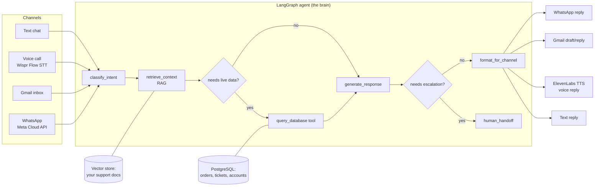

# Building a Customer Support Assistant: LangGraph + RAG + Voice + Email + WhatsApp

A learning-oriented architecture guide for a multi-channel (text, voice, email, WhatsApp) customer support agent, aimed at production-grade quality. You write the code; use this as the reference to check your work against.

## 1. The core idea

One reasoning "brain" (a LangGraph graph), one knowledge source (a RAG pipeline over your docs), one **tool** for looking up live data (PostgreSQL), and multiple *channels* that feed into the same brain: text chat, voice (Wispr Flow in / ElevenLabs out), email (Gmail), and WhatsApp (Meta Cloud API).



Why structure it this way: the channel (how the message arrives) and the reasoning (what to do about it) are separate concerns. Keeping them separate means you build the hard part — the agent's reasoning and grounding in your docs — once, and each channel is just a thin adapter that converts its input into a common message format and converts the output back into text, audio, or an email draft.

## 2. LangGraph: the agent's reasoning core

LangGraph models the agent as a **state graph**: a shared state object flows through **nodes** (Python functions), and **edges** decide what runs next, including conditional branches and loops. This is a better fit for support agents than a single prompt because real support conversations branch (is this a billing question or a bug report?), loop (ask a clarifying question, wait, continue), and sometimes need a human.

Core building blocks:

- **State**: a `TypedDict` or Pydantic model holding the conversation so far, retrieved context, detected intent, and a flag for escalation.
- **Nodes**: plain functions that read state and return updates, e.g. `classify_intent`, `retrieve_context`, `generate_response`, `human_handoff`.
- **Edges**: `add_edge` for a fixed next step, `add_conditional_edges` for branching (e.g., route to `human_handoff` if the model isn't confident, or if the customer asks for a person).
- **Checkpointer**: LangGraph's memory layer (e.g., `MemorySaver`, or a persistent store for production) that lets a conversation resume across turns — essential for a support agent since customers reply minutes or hours later.

Skeleton:

```python
from typing import TypedDict, List, Optional
from langgraph.graph import StateGraph, END
from langgraph.checkpoint.memory import MemorySaver

class SupportState(TypedDict):
    messages: List[dict]          # conversation history
    channel: str                  # "chat" | "voice" | "email"
    intent: Optional[str]
    context_chunks: List[str]     # retrieved RAG passages
    confidence: float
    needs_human: bool

def classify_intent(state: SupportState) -> dict:
    # small, fast LLM call: billing / technical / account / other
    ...
    return {"intent": intent}

def retrieve_context(state: SupportState) -> dict:
    query = state["messages"][-1]["content"]
    chunks = vector_store.similarity_search(query, k=4)
    return {"context_chunks": [c.page_content for c in chunks]}

def generate_response(state: SupportState) -> dict:
    # LLM call grounded in context_chunks, with a system prompt that
    # instructs it to say "I don't know" rather than guess, and to
    # cite which doc it used (for your own debugging, not necessarily shown to user)
    ...
    return {"messages": state["messages"] + [reply], "confidence": conf}

def route_after_generate(state: SupportState) -> str:
    if state["confidence"] < 0.5 or state["needs_human"]:
        return "human_handoff"
    return "format_for_channel"

def human_handoff(state: SupportState) -> dict:
    # create a ticket / notify a human, or in the Gmail channel,
    # save as a draft instead of auto-sending
    ...

graph = StateGraph(SupportState)
graph.add_node("classify_intent", classify_intent)
graph.add_node("retrieve_context", retrieve_context)
graph.add_node("generate_response", generate_response)
graph.add_node("human_handoff", human_handoff)
graph.add_node("format_for_channel", format_for_channel)

graph.set_entry_point("classify_intent")
graph.add_edge("classify_intent", "retrieve_context")
graph.add_edge("retrieve_context", "generate_response")
graph.add_conditional_edges("generate_response", route_after_generate,
                             {"human_handoff": "human_handoff",
                              "format_for_channel": "format_for_channel"})
graph.add_edge("human_handoff", END)
graph.add_edge("format_for_channel", END)

app = graph.compile(checkpointer=MemorySaver())
```

Each channel calls `app.invoke(...)` (or `.stream(...)`) with a `thread_id` per conversation, and the checkpointer handles remembering where things left off.

## 3. RAG: grounding answers in your own docs

Right now your project folder has no documents yet — the first real step is dropping your support material in (FAQs, policy docs, product manuals, past resolved tickets) so the agent has something to ground answers in instead of hallucinating.

Pipeline:

1. **Ingest**: load files (PDF, markdown, HTML export from a help center, etc.).
2. **Chunk**: split into ~300–800 token pieces with some overlap. Chunk by semantic unit (a whole FAQ entry, a whole policy paragraph) where possible rather than a fixed character count — this matters more for answer quality than embedding model choice.
3. **Embed**: turn each chunk into a vector (OpenAI `text-embedding-3-small`, or a local model via `sentence-transformers` if you want to avoid API cost).
4. **Store**: a vector database. For a learning project, `Chroma` (local, zero setup) or `FAISS` (in-memory) is enough; move to something like Pinecone/Weaviate/pgvector only once you need scale or multi-user filtering.
5. **Retrieve**: at query time, embed the customer's question and pull the top-k nearest chunks.
6. **Ground**: pass those chunks into the `generate_response` node's prompt, with an instruction to answer only from the provided context and say when it doesn't know.

```python
from langchain_community.document_loaders import DirectoryLoader
from langchain_text_splitters import RecursiveCharacterTextSplitter
from langchain_openai import OpenAIEmbeddings
from langchain_chroma import Chroma

docs = DirectoryLoader("./knowledge_base", glob="**/*.md").load()
chunks = RecursiveCharacterTextSplitter(chunk_size=500, chunk_overlap=50).split_documents(docs)
vector_store = Chroma.from_documents(chunks, OpenAIEmbeddings(), persist_directory="./vector_db")
```

Two practical tips worth internalizing early: keep a separate vector store per data-sensitivity tier if you ever mix public docs with internal/customer-specific data, and re-run ingestion whenever the source docs change — RAG quality degrades fast on stale content.

## 4. Voice in: Wispr Flow (speech-to-text)

Wispr Flow exposes a developer API for turning audio into clean text (it also does filler-word removal and formatting, which is handy for feeding directly into an LLM). Treat it as the adapter that turns a voice channel into the same `messages` format your text channel already uses:

```python
# Pseudocode — check api-docs.wisprflow.ai for current auth/endpoint details,
# since this is a newer API and specifics may have moved since this guide was written.
transcript = wispr_flow_client.transcribe(audio_bytes)
state["messages"].append({"role": "user", "content": transcript})
result = app.invoke(state, config={"configurable": {"thread_id": call_id}})
```

## 5. Voice out: ElevenLabs (text-to-speech / conversational agent)

You have two integration options:

- **TTS-only** (recommended to start): your LangGraph app produces text as usual, and you call ElevenLabs' `text_to_speech.convert` to synthesize the reply. Simple, and you keep full control of the reasoning in LangGraph.
- **ElevenLabs Conversational AI ("ElevenAgents")**: a hosted platform where ElevenLabs handles the voice turn-taking and can call out to tools/webhooks mid-conversation. More turnkey, but it shifts some orchestration out of LangGraph — worth exploring later once the text+RAG core works, not as the first thing you build.

```python
from elevenlabs.client import ElevenLabs

client = ElevenLabs(api_key=ELEVENLABS_API_KEY)
audio = client.text_to_speech.convert(
    voice_id="<your chosen voice id>",
    text=reply_text,
    model_id="eleven_turbo_v2_5",  # check current model names in ElevenLabs docs
)
```

## 6. Email channel: Gmail MCP

For handling customer requests that arrive by email, connect Gmail as a tool the agent (or you, running it) can call: search threads, read a message, and create a draft reply. I found the official Gmail MCP connector for this session — connecting it would let LangGraph's `human_handoff`/`format_for_channel` nodes read incoming support emails and prepare replies directly.

Design choice that matters here: **draft, don't auto-send.** Email is asynchronous and mistakes are costly (a wrong policy statement in writing is worse than a wrong sentence in a phone call), so the safest pattern is:

```python
def format_for_channel_email(state: SupportState) -> dict:
    reply_text = state["messages"][-1]["content"]
    gmail.create_draft(thread_id=state["email_thread_id"], body=reply_text)
    return {"status": "drafted_for_review"}
```

A human reviews and hits send. Once you trust the agent's accuracy on a narrow set of intents (e.g., "where is my order"), you can selectively auto-send only for those, gated by the `confidence` field already in your state.

## 7. Tool calling: querying your database (PostgreSQL)

RAG answers questions grounded in static docs. A lot of real support questions ("where's my order," "what plan am I on") need a lookup against live data instead — that's a **tool call**, not retrieval.

LangGraph's pattern: define tools with `@tool`, bind them to the model with `.bind_tools([...])`, execute them in a `ToolNode`, and route with the prebuilt `tools_condition` (goes to the tool node if the model asked for a tool call, otherwise continues).

```python
from langchain_core.tools import tool
from langgraph.prebuilt import ToolNode, tools_condition
import psycopg

@tool
def get_order_status(order_id: str, customer_email: str) -> str:
    """Look up the status of a customer's order. Requires the order id AND
    the email on the account, so the tool itself enforces you can't fetch
    someone else's order by guessing an id."""
    with psycopg.connect(DB_DSN) as conn:
        row = conn.execute(
            "SELECT status, eta FROM orders WHERE order_id = %s AND customer_email = %s",
            (order_id, customer_email),
        ).fetchone()
    return f"status={row[0]}, eta={row[1]}" if row else "no matching order found"

tools = [get_order_status]
llm_with_tools = llm.bind_tools(tools)
tool_node = ToolNode(tools)

graph.add_node("generate_response", generate_response)  # calls llm_with_tools
graph.add_node("tools", tool_node)
graph.add_conditional_edges("generate_response", tools_condition)
graph.add_edge("tools", "generate_response")  # loop back so the model can use the result
```

Non-negotiable rules for a database tool in a support agent, since this is the part most likely to go wrong in a "production-grade" system:

- **Never let the LLM write raw SQL against a writable connection.** Give it a small set of specific, parameterized functions (`get_order_status`, `get_account_plan`, `list_open_tickets`) instead of a generic "run this SQL" tool. A generic SQL tool is a direct path to prompt-injection-driven data exfiltration or destructive queries.
- **Use a read-only DB role** for the connection the agent uses (`GRANT SELECT` only, on specific tables/views — not the app's main writable user).
- **Scope every query to the authenticated customer** (e.g., require their email/account id as a parameter, as above) so one customer's session can't be tricked into pulling another customer's data.
- **Pool connections** (`psycopg_pool` or similar) rather than opening a new connection per call — matters once you have concurrent conversations across channels.

## 8. WhatsApp channel (Meta Cloud API)

Meta's WhatsApp Cloud API is the official, directly-from-Meta option (no Twilio markup), with a free tier for a monthly volume of conversations. Two moving parts:

- **Receiving**: Meta calls a webhook URL you host whenever a customer messages your business number. You verify the webhook once (a `GET` with a challenge token you echo back), then handle incoming `POST` requests.
- **Sending**: a plain HTTP POST to the Graph API.

```python
# Receiving (FastAPI example)
from fastapi import FastAPI, Request

app_api = FastAPI()

@app_api.get("/webhook")
def verify(hub_mode: str = None, hub_challenge: str = None, hub_verify_token: str = None):
    if hub_verify_token == WHATSAPP_VERIFY_TOKEN:
        return int(hub_challenge)
    return {"error": "invalid verify token"}, 403

@app_api.post("/webhook")
async def incoming(request: Request):
    payload = await request.json()
    # payload["entry"][0]["changes"][0]["value"]["messages"][0] has the message
    msg = payload["entry"][0]["changes"][0]["value"]["messages"][0]
    from_number = msg["from"]
    text = msg["text"]["body"]

    state["messages"].append({"role": "user", "content": text})
    result = app.invoke(state, config={"configurable": {"thread_id": from_number}})
    send_whatsapp_message(from_number, result["messages"][-1]["content"])
    return {"status": "ok"}

# Sending
import httpx

def send_whatsapp_message(to: str, body: str):
    httpx.post(
        f"https://graph.facebook.com/v22.0/{PHONE_NUMBER_ID}/messages",
        headers={"Authorization": f"Bearer {WHATSAPP_ACCESS_TOKEN}"},
        json={"messaging_product": "whatsapp", "to": to, "text": {"body": body}},
    )
```

Notes specific to this channel: use the customer's phone number as the LangGraph `thread_id` (same pattern as the email thread id / voice call id — one consistent conversation identity per channel), verify the `X-Hub-Signature-256` header on incoming webhooks so you're not processing spoofed requests, and remember Meta requires pre-approved message *templates* if you want to message a customer first (outside a 24-hour window since their last message) — free-form replies are fine within that window.

## 9. Suggested build order

Building all channels at once makes debugging hard, since you can't tell if a bad answer is a RAG problem, a tool-calling problem, or a channel-adapter problem. A more learnable order:

1. **Text + RAG only.** Get `classify_intent → retrieve_context → generate_response` working against a small set of real docs, tested via plain function calls or a CLI loop. This is where most of the "agent building" learning happens.
2. **Add the escalation branch and a checkpointer**, so multi-turn conversations and human handoff work.
3. **Add the database tool** (`get_order_status` etc.) with the tool-calling loop, still testing via CLI. Now the agent can answer both "what's your refund policy" (RAG) and "where's my order" (tool) correctly, and — importantly — knows which one to use for a given question.
4. **Add the email channel** (Gmail MCP, draft-only), since it reuses the same core graph and just adds an adapter.
5. **Add WhatsApp**, same idea — a webhook adapter in front of the same graph.
6. **Add voice** (Wispr Flow in, ElevenLabs out) last — it's the most "plumbing," least "agent logic," so save it for once the reasoning core is solid.
7. **Evaluate**: build a small set of test questions with known-good answers from your docs and DB, and check the agent's answers against them each time you change the prompt, chunking, or tool schema — this is what separates a demo from something you'd trust with real customers.

## 10. Making this production-grade

Things a demo skips that a system handling real customers can't:

- **Persistent checkpointer.** `MemorySaver` lives in process memory and is gone on restart. Swap in `PostgresSaver` (LangGraph ships a Postgres checkpointer) so conversations survive deploys and you can run more than one server process.
- **Structured logging + tracing.** You want to see, per conversation: which intent was classified, which RAG chunks were retrieved, which tool calls were made with what arguments, and the final response — both for debugging and for auditing what the agent told a customer. LangSmith (from the LangChain team) gives you this with minimal setup; a plain structured logger (JSON logs with a `thread_id` on every line) works too if you'd rather not add a dependency.
- **Timeouts and retries** on every external call (LLM, embeddings, DB, ElevenLabs, WhatsApp/Gmail APIs) — any one of these being slow or down shouldn't hang or crash the whole conversation. Wrap calls with a retry-with-backoff (`tenacity` is the common choice) and a sane timeout.
- **Rate limiting per customer/thread**, so one customer (or an abusive/looping agent) can't burn your LLM and API budget.
- **Secrets management.** API keys (OpenAI/Anthropic, ElevenLabs, Wispr Flow, WhatsApp access token, DB credentials) belong in environment variables or a secrets manager, never committed to the repo.
- **Webhook signature verification** for both Gmail push notifications (if you move beyond polling) and WhatsApp (`X-Hub-Signature-256`) — otherwise anyone who finds your webhook URL can inject fake messages.
- **PII handling.** Customer emails, phone numbers, and order data flow through logs, LLM prompts, and possibly third-party APIs (OpenAI, ElevenLabs). Know what you're sending to each provider and redact what you don't need to send (e.g., don't put full card numbers in a prompt, ever).
- **Deployment shape**: a small FastAPI app exposing the WhatsApp and Gmail webhook endpoints (and a chat endpoint), running the compiled LangGraph `app` per request, containerized (Docker), behind HTTPS. Outbound sends (WhatsApp/email) are good candidates for a background task queue rather than inline in the webhook handler, so a slow LLM call doesn't cause Meta/Google to retry the webhook and double-process a message. See §11 for the full CI/CD → Docker → Kubernetes → ArgoCD path.
- **Idempotency.** Webhooks retry on timeout — dedupe on the provider's message id so a slow response doesn't cause the agent to process (and reply to) the same customer message twice.

## 11. Deployment infrastructure: Docker, CI/CD, Kubernetes, ArgoCD

This is the path from "runs on my laptop" to "runs in production, deploys safely, and rolls back if something breaks." Layers, in order:

**Docker** — package the app so it runs the same everywhere. Multi-stage build keeps the final image small (build deps don't ship):

```dockerfile
# Dockerfile
FROM python:3.12-slim AS builder
WORKDIR /app
COPY requirements.txt .
RUN pip install --no-cache-dir --user -r requirements.txt

FROM python:3.12-slim
WORKDIR /app
COPY --from=builder /root/.local /root/.local
COPY . .
ENV PATH=/root/.local/bin:$PATH
ENV PYTHONUNBUFFERED=1
EXPOSE 8000
# healthcheck hits a lightweight endpoint, not a full graph invoke
HEALTHCHECK --interval=30s --timeout=3s CMD curl -f http://localhost:8000/health || exit 1
CMD ["uvicorn", "src.main:app_api", "--host", "0.0.0.0", "--port", "8000"]
```

**CI (GitHub Actions)** — on every push: lint, run tests (including the eval set from Sprint 9), build the image, push to a registry. CI should **not** deploy directly — that's ArgoCD's job (see below), triggered by CI updating a manifest, not by CI calling `kubectl`.

```yaml
# .github/workflows/ci.yml
name: CI
on:
  push:
    branches: [main]
  pull_request:

jobs:
  test:
    runs-on: ubuntu-latest
    steps:
      - uses: actions/checkout@v4
      - uses: actions/setup-python@v5
        with: { python-version: "3.12" }
      - run: pip install -r requirements.txt
      - run: pytest tests/
      - run: python scripts/run_eval.py  # the eval set from Sprint 9

  build-and-push:
    needs: test
    if: github.ref == 'refs/heads/main'
    runs-on: ubuntu-latest
    steps:
      - uses: actions/checkout@v4
      - uses: docker/build-push-action@v6
        with:
          push: true
          tags: ghcr.io/<you>/support-agent:${{ github.sha }}

  bump-manifest:
    needs: build-and-push
    runs-on: ubuntu-latest
    steps:
      # updates the image tag in your separate GitOps config repo,
      # which is the signal ArgoCD watches for — see below
      - uses: actions/checkout@v4
        with:
          repository: <you>/support-agent-config
          token: ${{ secrets.GITOPS_REPO_TOKEN }}
      - run: |
          sed -i "s|image: ghcr.io/<you>/support-agent:.*|image: ghcr.io/<you>/support-agent:${{ github.sha }}|" k8s/deployment.yaml
          git commit -am "bump image to ${{ github.sha }}" && git push
```

**Kubernetes** — the runtime. Minimum viable set of manifests:

```yaml
# k8s/deployment.yaml
apiVersion: apps/v1
kind: Deployment
metadata:
  name: support-agent
spec:
  replicas: 2
  selector: { matchLabels: { app: support-agent } }
  template:
    metadata: { labels: { app: support-agent } }
    spec:
      containers:
        - name: support-agent
          image: ghcr.io/<you>/support-agent:latest
          ports: [{ containerPort: 8000 }]
          envFrom:
            - secretRef: { name: support-agent-secrets }   # API keys, DB DSN
          readinessProbe:
            httpGet: { path: /health, port: 8000 }
            initialDelaySeconds: 5
          livenessProbe:
            httpGet: { path: /health, port: 8000 }
            initialDelaySeconds: 15
          resources:
            requests: { cpu: "250m", memory: "256Mi" }
            limits: { cpu: "1", memory: "512Mi" }
---
apiVersion: v1
kind: Service
metadata: { name: support-agent }
spec:
  selector: { app: support-agent }
  ports: [{ port: 80, targetPort: 8000 }]
---
apiVersion: autoscaling/v2
kind: HorizontalPodAutoscaler
metadata: { name: support-agent }
spec:
  scaleTargetRef: { apiVersion: apps/v1, kind: Deployment, name: support-agent }
  minReplicas: 2
  maxReplicas: 8
  metrics:
    - type: Resource
      resource: { name: cpu, target: { type: Utilization, averageUtilization: 70 } }
```

Two things worth understanding, not just copying: `readinessProbe` controls whether a pod receives traffic (fails during startup, e.g. while the vector store connection warms up), while `livenessProbe` controls whether Kubernetes restarts the pod (fails only if the process is truly stuck) — conflating the two causes either slow rollouts or unnecessary restarts. Secrets (`support-agent-secrets`) hold your LLM/ElevenLabs/Wispr Flow/WhatsApp/DB credentials as a Kubernetes `Secret` — never baked into the image or the plain manifest.

**ArgoCD (GitOps)** — instead of CI running `kubectl apply`, CI commits the new image tag to a Git repo (the `bump-manifest` job above), and ArgoCD continuously watches that repo and reconciles the cluster to match it. This means the cluster state is always exactly what's in Git (auditable, revertible with `git revert`), and a human/CI never needs cluster credentials directly.

```yaml
# argocd/application.yaml — apply this once to your cluster's ArgoCD
apiVersion: argoproj.io/v1alpha1
kind: Application
metadata:
  name: support-agent
  namespace: argocd
spec:
  project: default
  source:
    repoURL: https://github.com/<you>/support-agent-config
    targetRevision: main
    path: k8s
  destination:
    server: https://kubernetes.default.svc
    namespace: support-agent
  syncPolicy:
    automated:
      prune: true      # remove resources deleted from Git
      selfHeal: true    # revert manual kubectl edits back to match Git
    syncOptions:
      - CreateNamespace=true
```

Why a **separate config repo** (`support-agent-config`) from the app code repo: it keeps "what changed in the app" and "what's deployed right now" as independent, separately-audited histories, and lets ArgoCD watch a small, purely-declarative repo instead of your whole codebase.

Suggested order to actually build this (don't do it all at once): Docker locally first (`docker build`, `docker run`, confirm it works) → CI running tests and building/pushing an image → a single Kubernetes `Deployment`/`Service` applied manually with `kubectl apply` to confirm the manifests are correct → only then introduce the separate config repo and ArgoCD to automate what you were doing manually.

## 12. Glossary (for the "training to build agents" goal)

- **State graph**: a way of modeling an agent as nodes + edges over a shared state, instead of one big prompt. Makes branching, loops, and multi-step tool use explicit and debuggable.
- **Grounding**: making the LLM answer from retrieved context instead of its own memory, to reduce hallucination.
- **Checkpointer**: LangGraph's persistence layer for resuming a conversation's state across turns/sessions.
- **Human-in-the-loop / handoff**: a node that stops automation and routes to a person, gated by a confidence score or explicit customer request.
- **Adapter (channel)**: the thin layer that converts a channel-specific input (audio, email, WhatsApp webhook payload) into the common message format the graph expects, and converts the output back.
- **Tool calling**: giving the LLM a set of callable functions (with schemas) it can invoke mid-conversation — used here for database lookups, as distinct from RAG (retrieval of static docs).
- **Idempotency**: designing a handler so processing the same incoming event twice (e.g., a retried webhook) doesn't cause duplicate side effects (like sending two replies).
- **GitOps**: deploying by committing desired state to Git and having a controller (ArgoCD) reconcile the cluster to match, rather than pushing changes directly with `kubectl`.
- **Readiness vs. liveness probe**: readiness gates whether a pod *receives traffic*; liveness gates whether Kubernetes *restarts* the pod. Different failure conditions should trigger each.

## Next steps

You're writing the code — paste it in or point me at the file as you go and I'll check it against this guide (correctness, security gaps like the SQL-tool rules in §7, missed edge cases like webhook idempotency). Suggested first target per the build order above: `SupportState`, the `classify_intent → retrieve_context → generate_response` graph, and a CLI loop to test it against a few real docs in `knowledge_base/`.
